# 酒店管理系统

## 说明

<h3>此项目仅供学习，严禁用于商业用途</h3>

## 技术选型

**环境：** JDK1.8 + MySQL8.0.26 + Tomcat9.0.59 + Tomcat10.0.17

**前端技术栈：** HTML + CSS + JS + jQuery + LayUI-Mini2.6.3 + Dtree + Echarts

**后端技术栈：** Spring + SpringMVC + MyBatis + SpringSecurity + Redis

---

## 项目结构

项目名称|介绍
---|---
**[hotel-parent](../hotel-parent)**|**父项目**
**[hotel-generator](./hotel-generator)**|**逆向工程**
**[hotel-manager](./hotel-manager)**|**后台页面及控制层代码**
**[hotel-mapper](./hotel-mapper)**|**Mapper接口与XML**
**[hotel-pojo](./hotel-pojo)**|**存放实体类及前端返回接收参数与后端返回参数**
**[hotel-service](./hotel-service)**|**存放业务层与业务实现层代码**
**[hotel-util](./hotel-util)**|**存放工具类**
**[hotel-web](./hotel-web)**|**前台页面与控制层代码**

---

## 起步

**数据库文件：[SQL](./sql/ssm_hotel.sql)**

<mark>使用前请先将 **[[upload]](./upload)** 文件夹放入D盘中，再根据下图配置好tomcat启动路径，否则后台上传图片会报错</mark>

启动项目之前先配置一下 **[数据库连接池](./hotel-mapper/src/main/resources/db.properties)**
与 **[redis配置文件](./hotel-util/src/main/resources/jedis.properties)**

为避免tomcat冲突我使用了两个tomcat，配置如下

项目名|端口号|jmx端口号|访问路径|描述
---|---|---|---|---
**hotel-manager**|8080|1099|[访问路径](http://localhost:8080/login.jsp)|后台系统
**hotel-web**|8090|1100|[访问路径](http://localhost:8090/index.html)|前台系统

---

> **后台账号**

账号|密码|角色|描述
---|---|---|---
**admin**|**123456**|**超级管理员**|**拥有所有权限的管理员**
**system**|**123456**|**系统管理员**|**只拥有系统管理权限的管理员**
**hotel**|**123456**|**酒店管理员**|**拥有酒店管理和订单管理权限的管理员**
**user**|**123456**|**普通用户**|**可以登入后台的用户，但未给其角色分配权限所以登入也无数据**
**403**|**123456**|**403页面测试用户**|**用于测试403页面的用户，登入只会显示403**

---

# 业务讲解

## 后台

### 登录

<h3><mark>注意：首次进入加载会比较慢，耐心等一会就行了</mark></h3>
首先进来是登录页面，项目启动后会自动打开 [后台首页](http://localhost:8080)
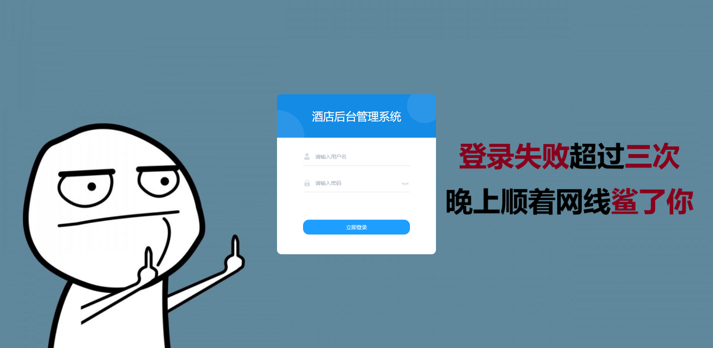

可以用上面给的账号进行登录，用admin进就是全部菜单都有，用403账号进的话就是 进入403页面，无权限与账号不存在或者密码错误都会进入403页面，主要是懒 就让它直接跳到403了

### 后台首页

登录之后首先会加载动画，再之后进入后台首页查看报表，大概长这样

这些菜单是根据用户的角色判断拥有的权限或菜单回显出来的，不拥有的菜单或权限会不显示， 菜单/权限的分配是在系统管理里的角色管理与权限管理来控制的，后面细说

登录配置了一下自己的UserDetailService后全权交给SpringSecurity去处理的

接下来介绍一下每个页面的功能吧

### 酒店管理 -> 房型管理

首先是 酒店管理中的 房型管理

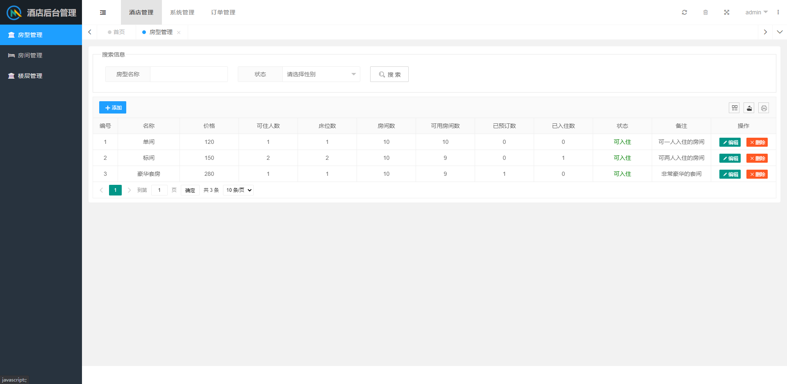

这个模块管理着酒店的房型，主要作用是与房间做关联，以及前台的展示作用

### 酒店管理 -> 楼层管理

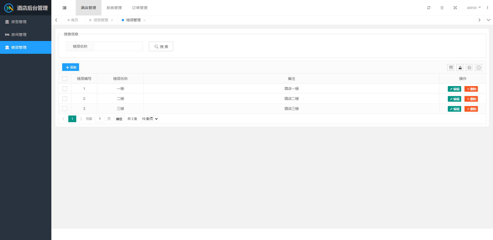

这个模块管理酒店的楼层，也是为了与房间做关联

由于这两个模块都是基础的增删改查，我就不赘述了

### 酒店管理 -> 房间管理

接下来是酒店管理中的房间管理，用作前台的展示，后面的预订会用到这里的数据

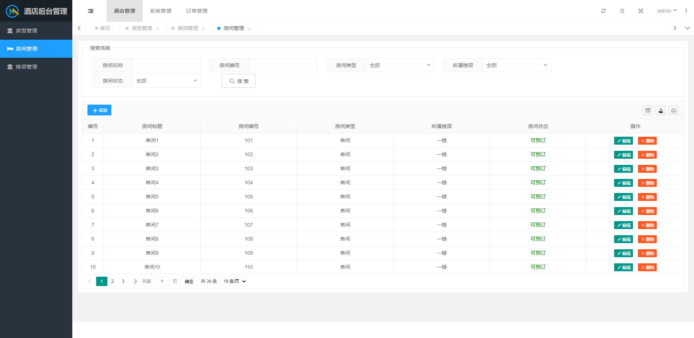

<strong>tips:项目中Redis在此处有使用到，主要用于渲染搜索框以及新增、修改框的数据</strong>

### 系统管理 -> 权限管理

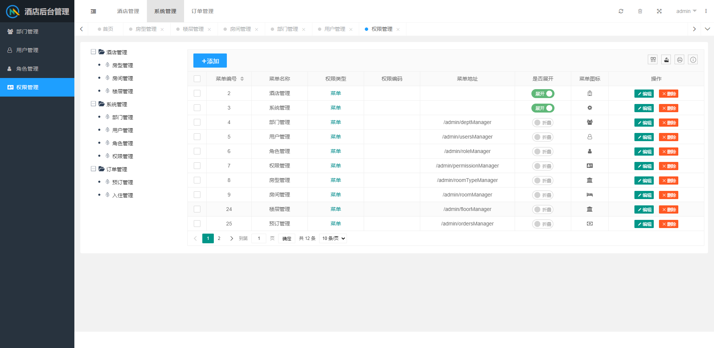

这里可以指定后台登录后的菜单，如果新增了一条需要从角色管理里给角色重新赋权限才可以看到新的菜单

不过没有页面的话新增了也没用哈哈哈哈哈哈

其次就是角色管理

### 系统管理 -> 角色管理

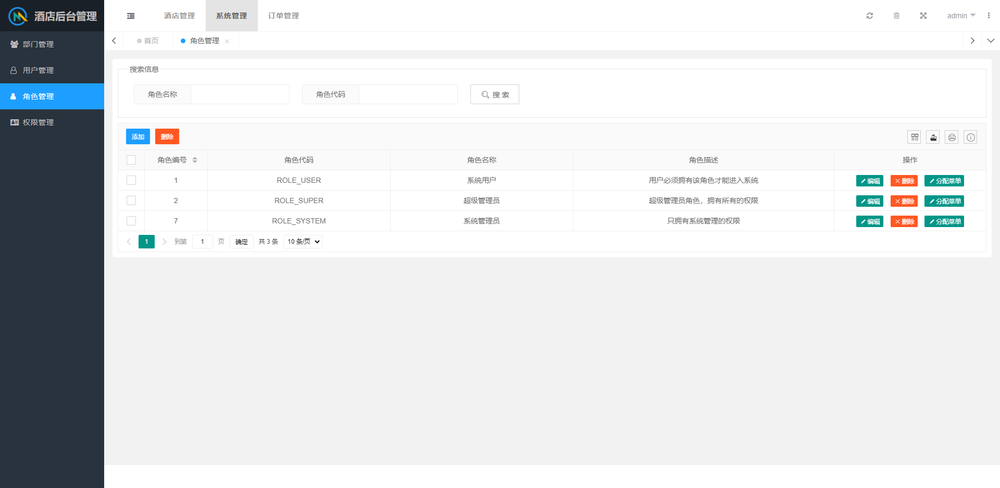

在角色管理里可以赋权限给角色，权限列表是从权限管理列表中拿到的，此处也用到了Redis

<strong>
注意：这个项目使用的是多角色，ROLE_USER这个角色是进入后台的角色，没有此角色无法进入到后台，是在 [spring-security.xml](./hotel-manager/src/main/resources/spring-security.xml)
中配置的</strong>

### 系统管理 -> 部门管理

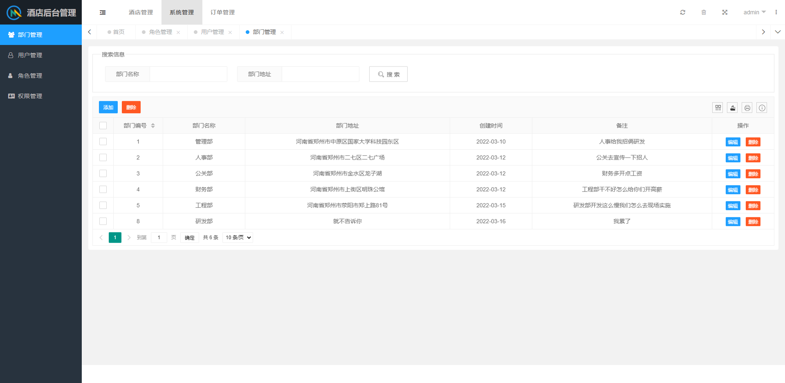

在部门管理里可以新增部门，主要作用就是分配用户的所属部门

### 系统管理 -> 用户管理

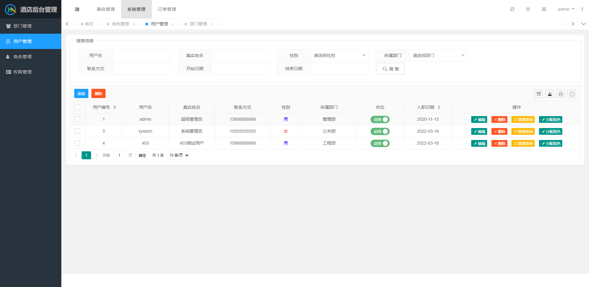

用户管理里搜索框与新增修改的窗口里渲染的部门数据，也是从redis中拿到的，关于redis让峰哥给你们讲

然后在这里可以去分配角色给用户

### 订单管理 -> 预订管理

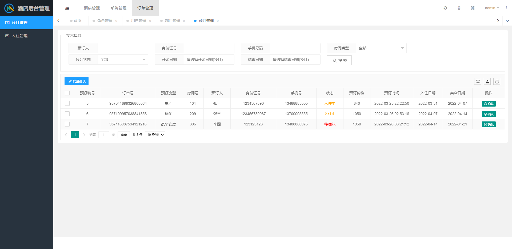

前台用户下单后，数据会到这里展示，然后在此处进行认

### 订单管理 -> 入住管理

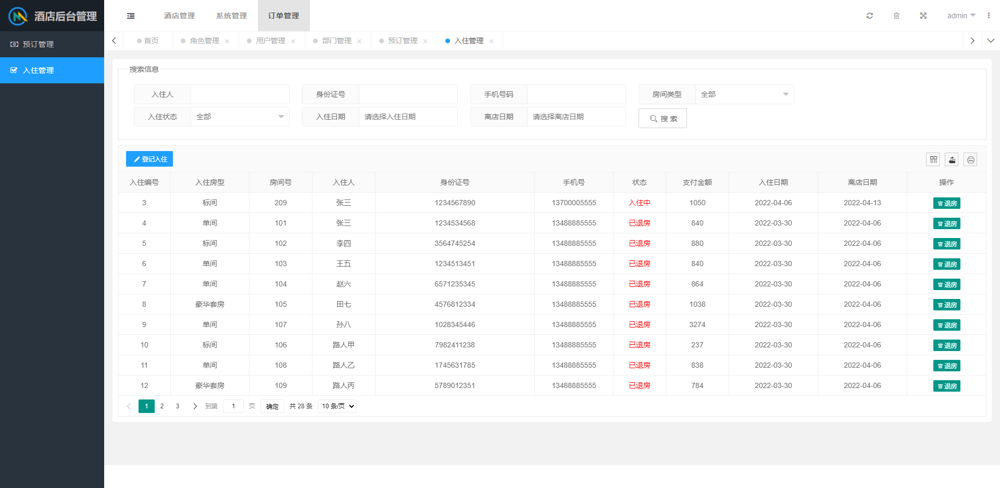

入住管理这里是用来办理入住及退房的，办理入住可以通过表格头上的登记入住进行登记

共有两种办理入住的方式，一种是对着订单管理里的数据一个一个手动输入，由于用户体验差，我测试的时候体验也差，就加上了个自动渲染的功能

可以在弹出来的窗口中点击选择订单，然后去选择订单渲染到表单中

为了方便测试 我在表中增加了许多假数据，如果造成数据错乱建议删除后重新走流程

<strong>注意：登记入住只能够登记订单管理中已确认的订单</strong>

那么关于后台我们就讲完了，接下来看一下前台

## 前台

### 首页

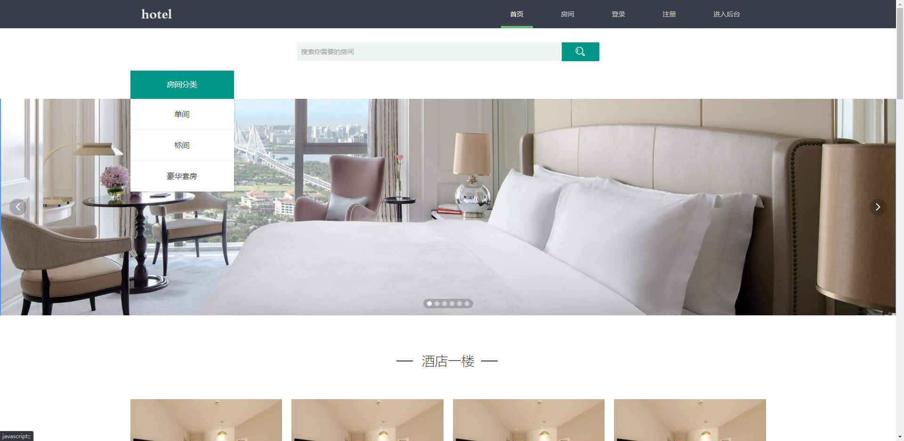

这里左侧的房间分类是从房型管理的表中获取并动态渲染的，下面的数据同理

可以通过点击房间来进入详情页，不过想进入详情页需要先登录才可以

### 房间列表

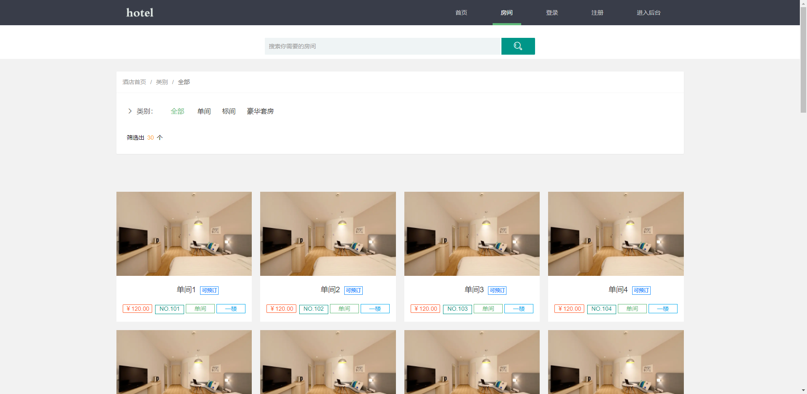

在这里可以进行一个房间列表的展示，可以通过导航栏上的框去筛选需要的内容

筛选条件-类别也是从后台的房型管理表中动态获取的

### 登录页

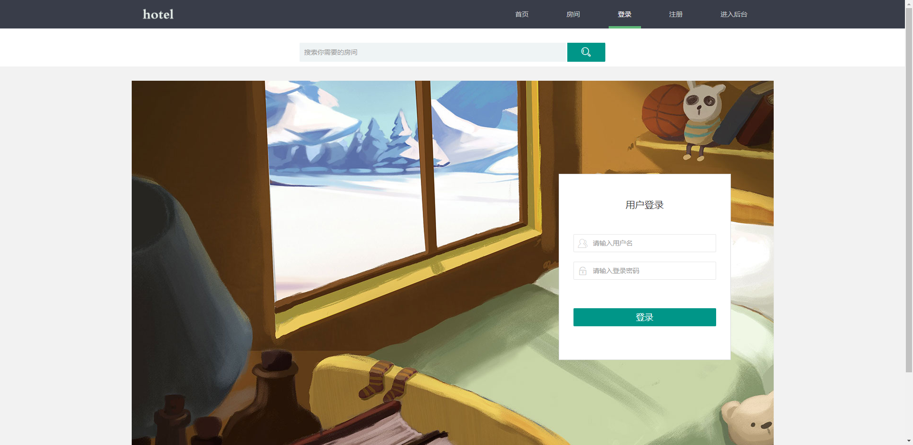

在这里进行一个登录操作，同样是交给Spring Security进行处理

### 注册页

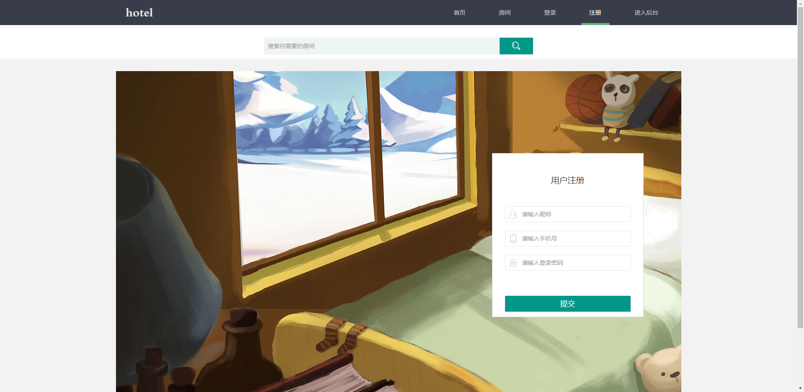

前台用户在此处进行注册，此处的用户管理与后台的用户管理不同，后台中的用户管理管理的是可以进入后台的用户

而这里是注册的前台用户，是无法进入后台的，由于逻辑过于简单我就没在后台写这个功能，有想法的同学可以试试写一下，或者让峰哥协助一下

在此处前端绑定了一个监听失去焦点的事件在用户名上，也就是说当焦点不在用户名这一栏的时候，会先向后台发送请求，查询数据库中是否拥有相同的用户名

如果存在相同的用户名，则会在用户名这一栏的右侧出现一个tips框来提示用户 用户名不可用，提升用户体验

在这里注册后就会跳转到登录页面，然后进行登录，登录完成后会自动跳到对应的链接中，并在导航栏上登录和注册的导航会消失

<strong>注意：导航中的进入后台，我是通过直接跳转地址进行请求的，需要同时把 [hotel-manager](./hotel-manager) 启动才可访问到</strong>

### 房间详情页

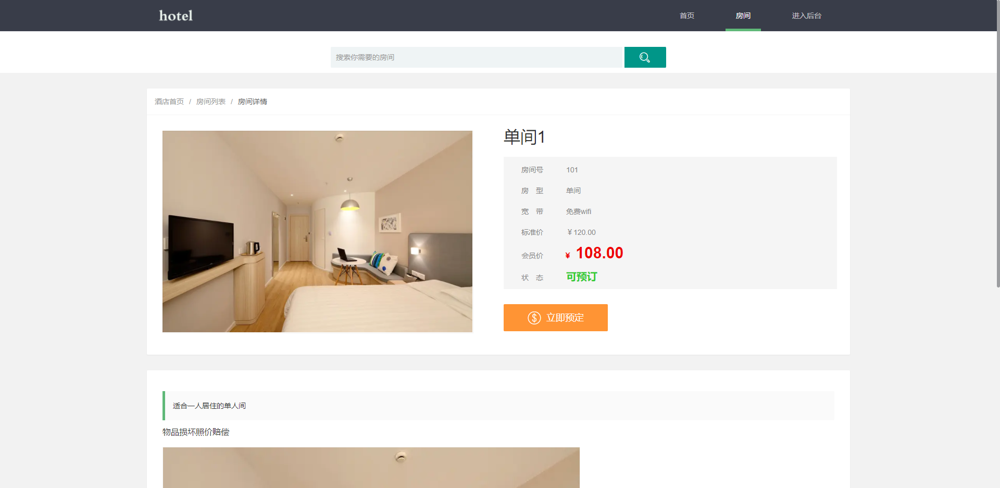

房间详情页主要是为了做下单的功能，这里的会员价需要会员角色才可以使用，普通用户则是通过标准价进行预订的

我忘记做这个成为会员的功能了，后续可以让峰哥带你们优化

在此处下完单后，就需要后台到订单管理中确认订单，然后由管理员在后台进行办理入住即可

退房时需要后台管理员点击入住管理中的退房进行退房，此处还有bug未改，如：客户提前退房，房费计算等问题

> <h3>此项目到这里就介绍差不多了，不会的地方可以缠着峰哥让他展开讲讲，希望同学们能够学有所成</h3>

